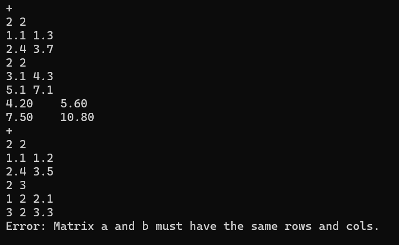
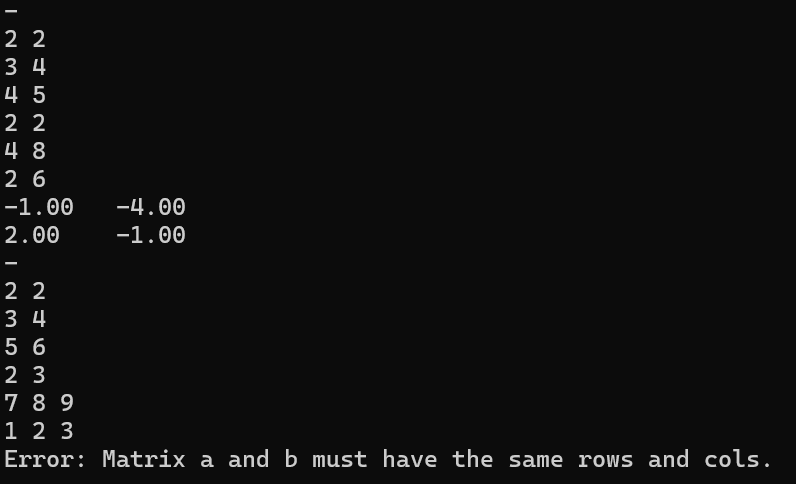
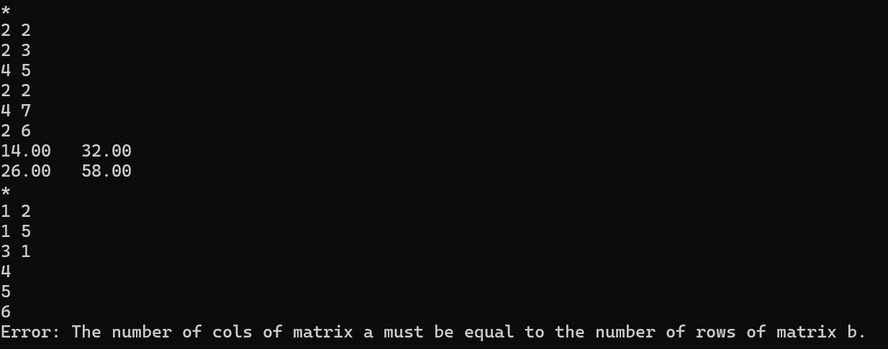
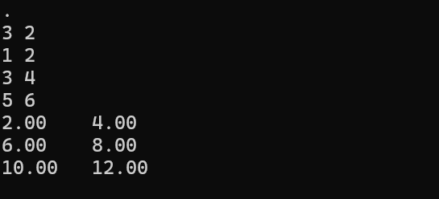
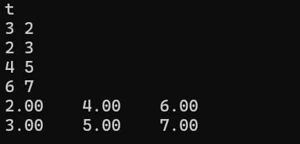
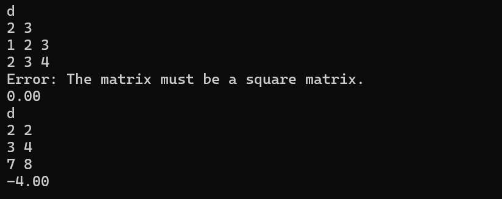
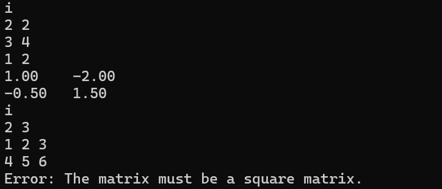
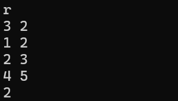
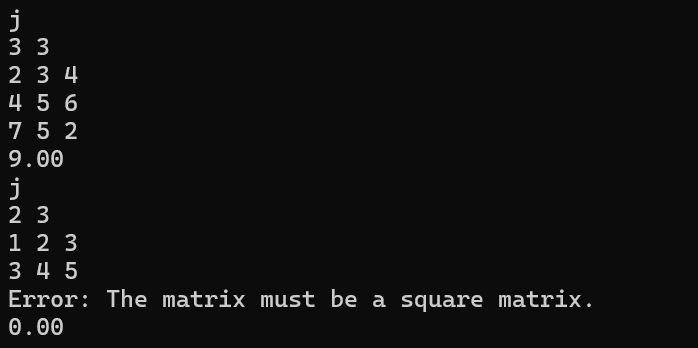

# Readme

## 一、大体思路

### 1、基本操作：

对于矩阵的加、减、乘、数乘和转置操作来讲，都比较的基础，没有很值得说道的细节。

### 2、矩阵的行列式

使用Laplace展开式，对于行列式进行化简，随后就可以利用递归把任意阶的行列式算出来了

为了求那个余子式，时间复杂度略显炸裂……似乎是 $O(N^4)$

### 3、矩阵的逆

利用伴随矩阵的算法，再加上之前行列式时算过的“余子式”，就可以把矩阵的逆表示出来

要注意这个函数里面不用再对（row！=col）进行判断，因为会调用det函数，那边会调用的

### 4、矩阵的秩

把高斯消元法的过程利用程序模拟出来：

从最左列到最右列，逐步处理每一行。每次先找到整列中的最大数，排到当前处理的行，随后把这行以下的所有的列数字都减成零即可

如果整列数字都是零，那么就对rank无影响

### 5、矩阵的迹

对角线加起来即可

## 二、运行截图

- 1、矩阵加法

- 2、矩阵减法

- 3、矩阵乘法

- 4、矩阵数乘

- 5、矩阵转置

- 6、矩阵行列式

- 7、矩阵求逆

- 8、矩阵求秩

- 9、矩阵求迹

